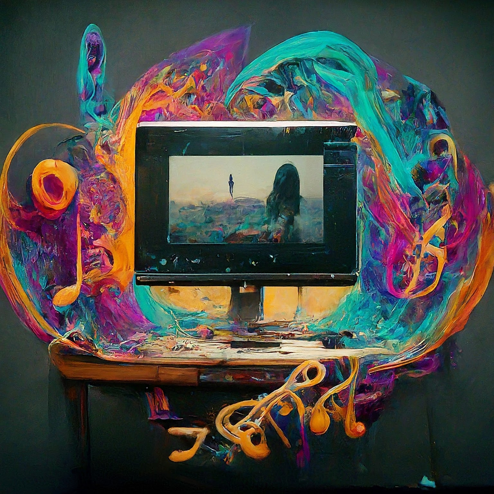

<p>
  <h1>
    
    Mus2Vid: Music visualization based on Multi-modal Large  Language Model and Video Generation
  </h1>
</p>

[](./documentation/userstudy.pdf)
[](https://ai4musicians.org/visualize.html)
[](https://github.com/Purdue-Artificial-Intelligence-in-Music/Mus2Vid-code)

This is the official repository for *[Mus2Vid](https://github.com/Purdue-Artificial-Intelligence-in-Music/Mus2Vid-code)* by *[Purdue University AIM Group](https://ai4musicians.org)*.

## 🚀 Introduction

Mus2Vid is a real-time art project that uses diffusion models to generate video depictions in response to classical  music. It uses recurrent and transformer networks to analyze input audio and estimate its emotion and genre qualities,  which are converted into text and fed to a text-to-image diffusion model to generate images.  It is currently adding components of the multimodal music large language model to enable an end-to-end prompt generation. 

<p align="center">
  
  Image generated by Gemini-pro.
</p>

## 🤗 Work Flow

The Mus2Vid project aims to generate visual content from raw audio input. The current workflow involves discrete stages of audio analysis, feature selection, emotion/genre classification, and prompt generation for subsequent image/video synthesis. 

However, the non-end-to-end nature of feature extraction and prompt generation has been identified as a bottleneck, leading to potential loss of musical nuance. To address this, we propose integrating an end-to-end multimodal music model to directly analyze the audio and generate text features, thus potentially improving the fidelity of the generated visual content.


<p align="center">
  
  Current structure of Mus2Vid (will be updated at the end of summer).
</p>

## 🤖  System Setup

We use Python 3.10.11 for this project and the library requirements are given in env.yml. Create a conda environment using
```
conda create --name <env> --file env.yml
```
Ensure that the NVIDIA Driver is version 11.8 or above to be compatible with PyTorch 2.0.1.

We borrowed some code from these well-known repositories:
- [Mu-LLaMA](https://github.com/shansongliu/MU-LLaMA)
- [RIFE](https://github.com/hzwer/ECCV2022-RIFE)
- [Real-ESRGAN](https://github.com/xinntao/Real-ESRGAN)

The needed pretrained multi-modal encoder and image decoder models can be found here:
- [MERT](https://huggingface.co/m-a-p/MERT-v1-330M)
- [ Stable Diffusion XL](https://huggingface.co/stabilityai/stable-diffusion-xl-base-1.0)


The directory of the prototype folder can be organized as follows:
```
.
├── ... (other files)
├── ThreadedPrototype
│   ├── AudioThreadWithBufferPorted.py
│   ├── basic_pitch_modified
│       ├── ...  
│   ├── old_code 
│       ├── ...  
│   ├── utils
│       ├── ...                     
│   ├── emotion.py
│   ├── features_modified.py
│   ├── genre_prediction.py
│   ├── image_generation.py
│   ├── img_display_thread_amp.py
│   ├── prompting.py
│   ├── threaded_parent.py
│   ├── video_generation.py
└── ...

```

Once downloaded, user can run the main program by threaded_parent.py.

For model with MusicGen
```
python threaded_parent.py
```

## 💻 Interpretation of code

**ThreadedPrototype:** Main directory containing the project's source code.

**utils:** Houses utility functions, helper classes, and potentially external models or libraries used within the project.

**basic_pitch_modified:** A modified version of Spotify's Basic Pitch library, adapted to accept raw audio arrays directly for pitch analysis.

**threaded_parent.py:** The main script containing the core functionality and user interface.  **Run this file to start the application.**

**AudioThreadWithBufferPorted.py:**
- Manages audio input/output operations in a separate thread.
- Includes the `get_last_samples(n)` function to retrieve the most recent audio samples for analysis.

**features_modified.py:**
- `SinglePyAudioThread`: Extends `AudioThreadWithBufferPorted` to process audio and extract features for emotion and genre prediction.
- `ModifiedMIDIFeatureThread`: Extracts MIDI features from the MIDI data generated by `SinglePyAudioThread`.

**emotion.py:** Predicts the emotional valence (positive/negative) and arousal (intensity) of the audio using features from `SinglePyAudioThread`.
- The predicted values are stored in `self.emo_values`.

**genre_prediction.py:** Predicts the genre of the audio based on features extracted by `SinglePyAudioThread`.
- The predicted genre is stored in `self.genre_output`.

**prompting.py:** Performs k-nearest neighbors (k-NN) search on a list of prompts to select the most relevant one.
- The selected prompt is stored in `self.prompt`. (Planned integration with GPT for prompt generation)

**image_generation.py:** Takes the selected prompt and generates corresponding images.
- The latest generated image(s) are available in `self.output`.

**img_display_thread_amp.py:**  
- Uses OpenCV to display the generated images from `image_generation.py` in a graphical user interface (GUI).


## 🗄️ Dataset
**[Will be released when the project is completed]**

## 🔧 Model Training
**[Will be released when the project is completed]**

## 🔨 Model Testing and Evaluation
**[Will be released when the project is completed]**

## 🧰 System Hardware requirements
Video generation will require GPU capabilities, code training and reasoning to be done on the A100 and RTX4090.

## 🫡 Acknowledgements

This code contains elements from the following repo:
- [Mu-LLaMA](https://github.com/shansongliu/MU-LLaMA)
- [RIFE](https://github.com/hzwer/ECCV2022-RIFE)
- [Real-ESRGAN](https://github.com/xinntao/Real-ESRGAN)


## ✨ Cite our work
If you find this repo useful, please consider citing: 
```bibtex
User Study:
@inproceedings{cai2024visualize,
  title={Visualize Music Using Generative Arts},
  author={Ng, Brian and Sudhoff, Samantha and Li, Haichang and Kamphuis, Joshua and Nadolsky, Tim and Chen, Yingjie and Yun, Kristen Yeon-Ji and Lu, Yung-Hsiang},
  booktitle={2024 IEEE Conference on Artificial Intelligence (CAI)},
  year={2024},
  address={Singapore}
}
```

